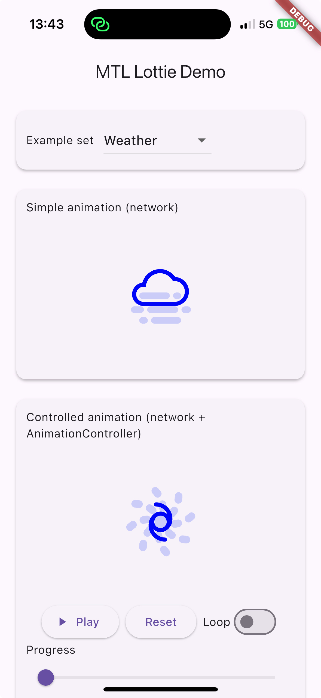

# Lottie POC (Flutter)

Demo app showcasing the `lottie` Flutter package with:

- Simple, controlled, and high-FPS Lottie animations
- Runtime property overrides with `LottieDelegates` (text/color/opacity/position)
- Selectable example sets (Mobilo, General, Weather, Loaders)
- Centered cards for clear visual separation
- Playback controls: play/pause toggle, loop toggle, progress scrubber (disabled while looping)

## Requirements

- Flutter 3.9+ (Dart 3.9+)

## Setup

1. Install dependencies:
   - `flutter pub get`
2. Run:
   - Mobile/Desktop: `flutter run`
   - Web: `flutter run -d chrome --web-renderer canvaskit`

Notes:
- Animations are loaded from public GitHub URLs; no local assets required.
- If you previously added assets and see pubspec errors, run `flutter clean` and retry.

## Contributing

Issues / PRs welcome. Keep the scope minimal and docs-linked.

## License

MIT License

Copyright (c) 2025 MusicTech Lab

Permission is hereby granted, free of charge, to any person obtaining a copy
of this software and associated documentation files (the "Software"), to deal
in the Software without restriction, including without limitation the rights
to use, copy, modify, merge, publish, distribute, sublicense, and/or sell
copies of the Software, and to permit persons to whom the Software is
furnished to do so, subject to the following conditions:

The above copyright notice and this permission notice shall be included in all
copies or substantial portions of the Software.

THE SOFTWARE IS PROVIDED "AS IS", WITHOUT WARRANTY OF ANY KIND, EXPRESS OR
IMPLIED, INCLUDING BUT NOT LIMITED TO THE WARRANTIES OF MERCHANTABILITY,
FITNESS FOR A PARTICULAR PURPOSE AND NONINFRINGEMENT. IN NO EVENT SHALL THE
AUTHORS OR COPYRIGHT HOLDERS BE LIABLE FOR ANY CLAIM, DAMAGES OR OTHER
LIABILITY, WHETHER IN AN ACTION OF CONTRACT, TORT OR OTHERWISE, ARISING FROM,
OUT OF OR IN CONNECTION WITH THE SOFTWARE OR THE USE OR OTHER DEALINGS IN THE
SOFTWARE.

## 🪪 License

MIT License — © 2025 MusicTech Lab

Built with ❤️ by MusicTech Lab.
