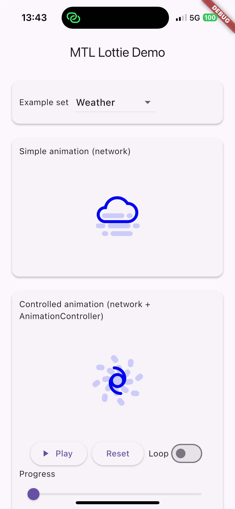

# Lottie POC (Flutter)

Demo app showcasing the `lottie` Flutter package with:

- Simple, controlled, and high-FPS Lottie animations
- Runtime property overrides with `LottieDelegates` (text/color/opacity/position)
- Selectable example sets (Mobilo, General, Weather, Loaders)
- Centered cards for clear visual separation
- Playback controls: play/pause toggle, loop toggle, progress scrubber (disabled while looping)

## Requirements

- Flutter 3.9+ (Dart 3.9+)

## Setup

1. Install dependencies:
   - `flutter pub get`
2. Run:
   - Mobile/Desktop: `flutter run`
   - Web: `flutter run -d chrome --web-renderer canvaskit`

Notes:
- Animations are loaded from public GitHub URLs; no local assets required.
- If you previously added assets and see pubspec errors, run `flutter clean` and retry.

## Contributing

Issues / PRs welcome. Keep the scope minimal and docs-linked.

## License

MIT License — see [LICENSE](LICENSE) for details.

---

  MusicTech Lab - Rockstars Developers dedicated to the Music Industry 
  <a href="https://musictechlab.io">Website</a>
   | 
  <a href="https://linkedin.com/company/musictechlab">LinkedIn</a>
   | 
  <a href="https://musictechlab.io/contact">Let's talk</a> 
  Crafted by <a href="https://musictechlab.io">musictechlab.io</a>

